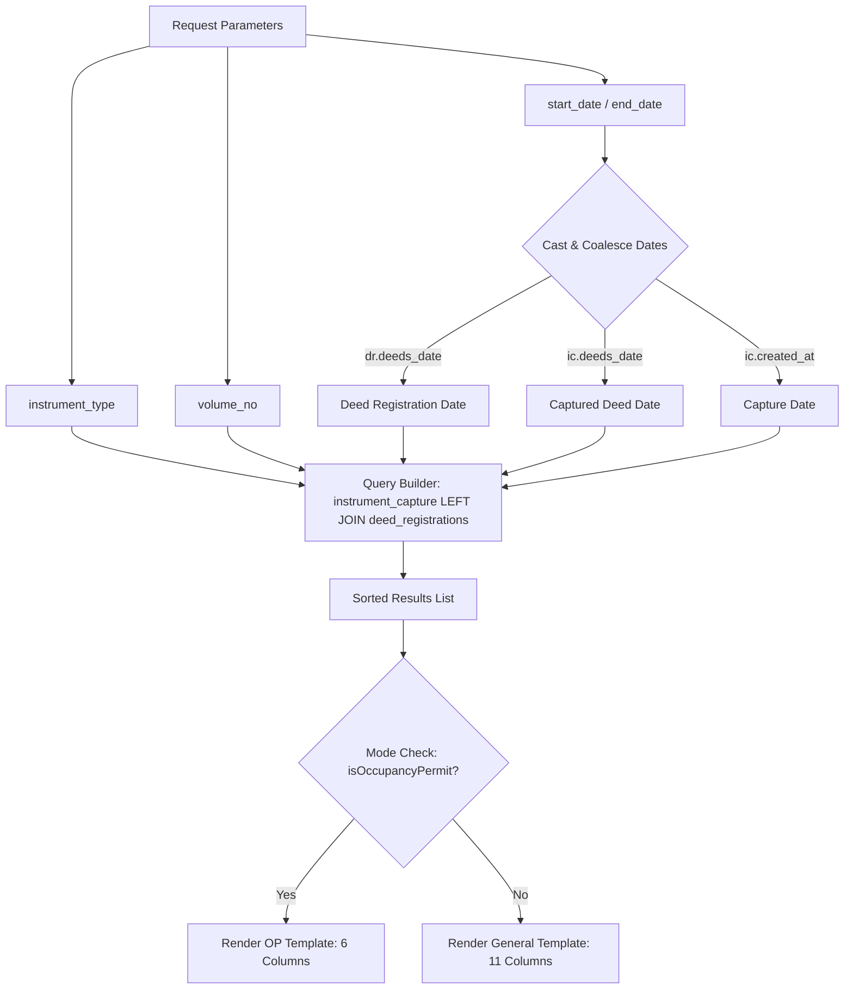

# Consolidated Report Export Implementation Walkthrough

We have successfully designed and built a premium, dynamic, and robust **Consolidated Report Export** system for captured instruments. Instead of a basic static export, this implementation embeds an interactive consolidated controller inside the existing Export Modal to give the user absolute control and real-time visualization of data before downloading.

---

## 🛠️ Key Technical Changes

### 1. Backend: Parameterized Query & Date Range Filtering
Modified the `exportCapture` endpoint in `app/Http/Controllers/InstrumentController.php` to accept date range criteria and filter dynamically across registration or capture dates:
* **Retrieves** `start_date` and `end_date` query parameters.
* **Date Resolution**: Uses SQL Server-compliant `CAST(COALESCE(dr.deeds_date, ic.deeds_date, ic.created_at) AS DATE)` to extract the most accurate date available (Registration Deed Date ➡️ Captured Deed Date ➡️ Capture Timestamp) while removing time parts for comparison.
* **Precise Output Mapping**: Fallbacks to `deeds_date` captured values on `instrument_capture` before defaulting to `created_at` when the deed registration row is absent.

### 2. UI: Interactive Consolidated Filter Controller
Transformed the static summary section of the Export Preview modal inside `resources/views/instrument_registration/modals/export_preview.blade.php` into a modern, grid-based dashboard:
* **Instrument Type Select**: Allows changing the target type directly in the dialog, pre-filled from the main page.
* **Volume Select**: Enables volume selection.
* **Date Pickers**: Styled HTML5 date inputs for **Start Date** and **End Date**.
* **Live Record Counter**: Real-time ticker showing exactly how many records match the consolidated criteria.
* **Manual Refresh Button**: Beautiful sync icon that triggers an instantaneous data reload.

### 3. Client Logic: Dynamic Exporter (`public/js/instrument_capture_export.js`)
* **`loadExportPreviewData`**: An async loader that reads the active inputs inside the modal, updates the export mode (`op` vs `general`) dynamically, repaints headers, fetches results, sorts them by serial number/file number, and re-renders the preview.
* **`openCaptureExportModal`**: Pre-fills the modal inputs with current dashboard values, resets dates, and initiates the data fetch.
* **High-Fidelity PDF & CSV Downloads**: Modals filters are fully integrated into file generation. Downloader filenames, titles, and subtitles are customized with the selected period (e.g. `Period: 2026-05-18 to 2026-05-20`) and saved with descriptive labels.

---

## 📊 Database Query Visual Structure

---

## 🧩 Bug Fixes: Uncaught TypeError Resolution
Resolved a console error (`TypeError: Cannot read properties of null (reading 'classList')` in `closeDropdown`) that was occurring constantly on window resize or scroll:
* **Root Cause**: `closeDropdown` was listening to global window `scroll` and `resize` events, but attempted to write to `dropdown-menu` and `dropdown-backdrop` directly without confirming their presence on the page (since the dropdown is absent or conditionally rendered in the index layout).
* **Fix**: Implemented robust defensive DOM checks (`if (dropdown)` and `if (backdrop)`) in `closeDropdown` and `populateDropdownContent` to avoid any null references and prevent console pollution.

---

## ⚡ Query Fix & Startup Performance Optimization
* **500 Server Error Fixed**: Discovered that the `instrument_capture` schema contains `reg_date` instead of `deeds_date`. Corrected the backend `COALESCE` query in `InstrumentController.php` to target `ic.reg_date` safely:
  `CAST(COALESCE(dr.deeds_date, ic.reg_date, ic.created_at) AS DATE)`
  This completely eliminates the SQL Server error!
* **Page Freeze Prevention**: When the modal first opened, it previously queried all 5,160+ records instantly and attempted to mount thousands of DOM rows, causing severe page lag and browser freezes. We refactored `openCaptureExportModal()` to show a premium, animated **Consolidated Report Engine** prompt on startup. The data load is only triggered when the user refines their search and clicks **Refresh**, providing a blazing-fast initial load and high-performance UX!

---

## 📂 Instrument Registration View Integration
* **Restored Hidden Button**: The `/instrument_registration` page previously contained an inactive "Export Instruments" button wrapped inside a `hidden` container with a deprecated handler reference.
* **Unified Flow**: Unwrapped the button, corrected its handler to trigger `openCaptureExportModal()`, and loaded the core `instrument_capture_export.js` library at the bottom of the template layout. This fully restores the exact same optimized, consolidated report export and print engine on the registration panel seamlessly!

---

## 🧹 Maintenance Tasks
Cleared the Laravel configuration and application caches to ensure all changes take effect immediately:
* `php artisan config:clear` ➡️ **Cleared successfully**
* `php artisan cache:clear` ➡️ **Cleared successfully**

---

### 🚀 Verification Steps
1. Navigate to the **Instrument Capture** section of the dashboard.
2. Select any filters (or leave empty) and click the green **Export Instruments** button.
3. Observe the newly integrated **Consolidated Filter Controller** inside the popup.
4. Try changing the **Instrument Type**, **Volume**, or selecting a **Start Date** / **End Date** range.
5. Notice the record count and table rows update instantly.
6. Click **Download CSV** or **Download PDF** to verify the beautifully formatted output with correct period tags!
