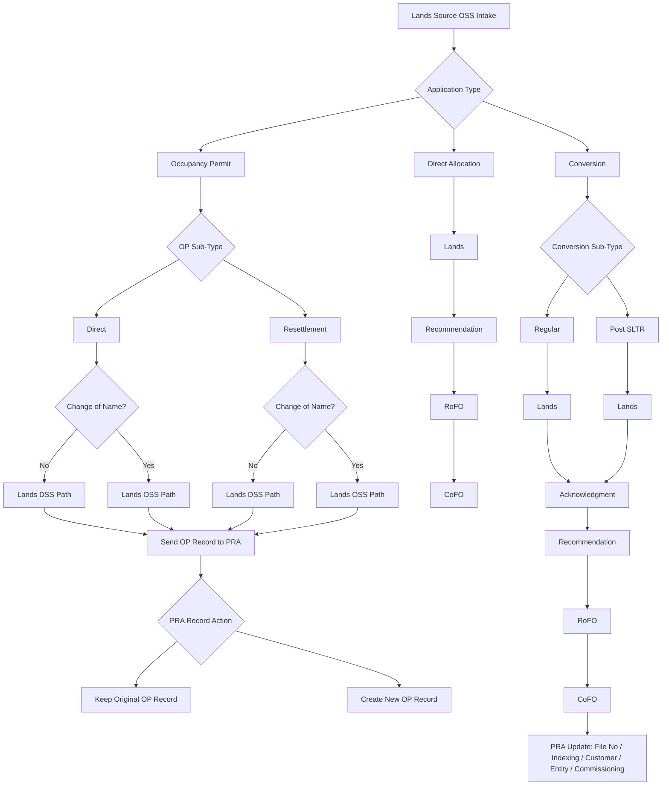

# Lands Source OSS Workflow Redesign

## Objective
Define a clear, implementation-ready workflow for Lands Source OSS processing across:
1. Occupancy Permit
2. Direct Allocation
3. Conversion

This redesign standardizes steps, decision points, and PRA record outcomes.

## High-Level Workflow Map

## Detailed Process Rules

### 1. Occupancy Permit (OP)
1. User selects OP sub-type: `Direct` or `Resettlement`.
2. System evaluates `Change of Name` flag.
3. Route selection:
   - `No Change of Name` -> Lands DSS processing path.
   - `Change of Name` -> Lands OSS processing path.
4. After path completion, system sends OP result to PRA.
5. PRA handling must support both:
   - Preserve original OP record.
   - Create linked new OP record where required.
6. System must keep explicit linkage: `old_record_id -> new_record_id`.
  
### 2. Direct Allocation
1. Intake at Lands.
2. Recommendation stage.
3. RoFO generation/approval.
4. CoFO issuance.
5. Final status marked as completed allocation workflow.

### 3. Conversion
1. User selects conversion sub-type: `Regular` or `Post SLTR`.
2. Both sub-types pass through Lands stage.
3. Both converge at Acknowledgment.
4. Continue sequentially:
   - Recommendation
   - RoFO
   - CoFO
5. On CoFO completion, update PRA artifacts:
   - file number
   - indexing
   - customer/entity profile
   - commissioning metadata if applicable

## Status Model (Recommended)
Use explicit status codes for traceability:

1. `INTAKE`
2. `LANDS_REVIEW`
3. `ACKNOWLEDGED`
4. `RECOMMENDED`
5. `ROFO_READY`
6. `ROFO_APPROVED`
7. `COFO_READY`
8. `COFO_ISSUED`
9. `PRA_SYNCED`
10. `COMPLETED`

For OP-specific branching, include:

1. `OP_DIRECT`
2. `OP_RESETTLEMENT`
3. `CHANGE_NAME_YES`
4. `CHANGE_NAME_NO`

## PRA Synchronization Rules
1. Every completed OP/Conversion outcome must generate a deterministic PRA sync event.
2. Sync payload should include:
   - source workflow type
   - source record id
   - original record reference (if any)
   - new record reference (if created)
   - file number metadata
   - customer/entity references
3. Sync must be idempotent using a unique transaction key.
4. Log success/failure with retry support.

## UI/Implementation Notes
1. Show branch context badge on each record:
   - `OP Direct`, `OP Resettlement`, `Conversion Regular`, `Conversion Post SLTR`.
2. For OP with change of name, display both:
   - Original OP snapshot
   - New OP target record
3. Disable downstream actions until prerequisite step is completed.
4. Keep approval timeline visible in all modules.

## Minimal Data Contract (Suggested)
Core fields to persist per workflow record:

1. `workflow_type`
2. `workflow_sub_type`
3. `change_of_name`
4. `source_record_id`
5. `original_pra_record_id`
6. `new_pra_record_id`
7. `status`
8. `status_changed_at`
9. `processed_by`
10. `approved_by`
11. `pra_sync_status`
12. `pra_sync_reference`

## Rollout Plan
1. Implement status and branch normalization in service layer.
2. Add old/new PRA linkage for OP flows.
3. Wire conversion convergence into a single post-lands pipeline.
4. Add automated PRA sync after CoFO issuance.
5. Add audit logging and dashboard counters per branch.

## Acceptance Criteria
1. OP Direct/Resettlement both support change-of-name branching.
2. OP sends records to PRA with original/new linkage where required.
3. Direct Allocation always follows Lands -> Recommendation -> RoFO -> CoFO.
4. Conversion (Regular/Post SLTR) converges at Acknowledgment and completes full chain.
5. PRA update payload includes indexing + customer/entity + file metadata.
6. Workflow timeline is visible and consistent across modules.
