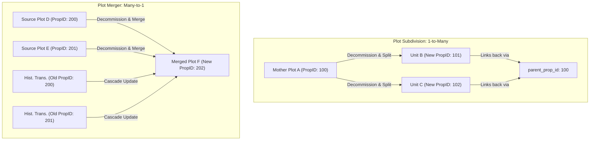

# Plot Management Technical Study: Subdivision, Merger, & Extension Workflows
**KLAES Land Administration & Registry System Monolith**

---

## 1. Executive Summary & Core Architectural Goals

The KLAES codebase integrates a strict **Property ID (PropID)** lineage system and clear data lifecycle processes to manage changes in physical land shapes. When land changes boundaries—whether divided, combined, or adjusted—the system must preserve historical data continuity while preventing data duplication.

This study details the business rules, database schema designs, operational workflows, and code logic governing **Plot Subdivision**, **Plot Merger**, and **Plot Extension/Exclusion** in the Laravel-based SQL Server monolith.

### System Safeguards
1. **Zero Active Duplication**: Core active tables (`fileNumber`, `file_indexings`, `customers_staging`, `entities_staging`) must maintain exactly one record per active land parcel.
2. **Decommission-on-Replace**: Whenever a parcel is divided or merged, its active files are permanently removed from daily index tables and moved to the `decommissioned_files` archive.
3. **Historical Traceability**: Past transactions (CofO, Deeds, PRA, Valuation records) are never deleted. Instead, they are linked using dynamic PropID relationships so legal search results remain complete.

---

## 2. Technical Taxonomy: The Three Workflows



### A. Plot Subdivision (1-to-Many)
* **Real-World Scenario**: An owner divides a large "Mother Plot" into separate commercial units or residential plots (e.g., building a plaza with individual retail shops).
* **Lineage Principle**: The mother parcel's history belongs equally to all newly formed units. However, actions taken on a new unit (e.g., a mortgage taken on Unit B) must not appear on Unit C.
* **Database Execution**:
  1. **Archive**: The active Mother record is copied into the `decommissioned_files` table with the decommissioning reason `"Subdivision"`.
  2. **Active Deletion**: The Mother record is hard-deleted from `fileNumber`, `file_indexings`, `entities_staging`, and `customers_staging`.
  3. **New Entity Generation**: Standalone active records are created for each subdivided unit (e.g., `2026.1`, `2026.2`).
  4. **PropID Allocation**:
     - Each new unit is allocated a **brand-new, unique PropID** via the `PropertyIdAllocationService`.
     - The new active records save the Mother's file number in their `Related File No` and `Decommissioned Records` fields.
     - A new database column `parent_prop_id` is populated on the units, pointing back to the Mother's original PropID.
  5. **History Search Resolution**: When a legal search is conducted on Unit B (PropID `101`), the search engine queries transactions for PropID `101` and cascades up to retrieve the Mother's historical records (PropID `100`).

---

### B. Plot Merger (Many-to-1)
* **Real-World Scenario**: An owner buys adjacent plots (e.g., Source Plots D and E) and combines them into one large industrial complex (Plot F).
* **Lineage Principle**: The new consolidated plot inherits the combined history of all source properties. The individual source plots cease to exist as separate legal entities.
* **Database Execution**:
  1. **Archive & Delete**: All source active files (D and E) are moved to the `decommissioned_files` table and hard-deleted from the active search index.
  2. **Consolidated Entry**: A single new active record is created for Plot F (e.g., `2026.600`).
  3. **PropID Re-Allocation**:
     - A **new, unique PropID** is assigned to Plot F.
  4. **Cascading PropID Update (History Transfer)**:
     - Unlike subdivision, the system performs a cascading database update across all historical transaction tables (`pra`, `deeds_registrations`, `c_of_o`, `billings`, `file_history_staging`).
     - Any past transaction referencing the old PropIDs (D or E) is updated to point directly to Plot F's new PropID.
     - This joins the complete history of both source plots into a single, unified timeline.

---

### C. Plot Extension & Exclusion (1-to-1 Adjustment)
* **Real-World Scenario**: Adjusting plot boundaries or extending a plot's layout by incorporating a small neighboring strip of land.
* **Lineage Principle**: Because this is a 1-to-1 replacement, it is treated as a specialized **Merger**. The original record is replaced entirely by the new extended layout.
* **Database Execution**:
  1. The original active files are archived in `decommissioned_files` and deleted from active search indexes.
  2. A new active record is created with the updated spatial boundaries and size.
  3. A new PropID is generated for the extended property.
  4. A cascading database update changes all historical records linked to the old PropID to use the new PropID, ensuring a continuous timeline.

---

## 3. Database Architecture & Schema Map

To support these workflows, the KLAES database structure relies on specific columns and tables:

### Core Tables Involved
* **`fileNumber` / `file_indexings`**: The primary tables for active registry searches.
* **`decommissioned_files`**: Holds metadata for all retired properties.
* **`pra` / `deeds_registrations` / `c_of_o` / `file_history_staging`**: Historical transactions that maintain the legal chain of title.

### Specialized Columns
* **`parent_prop_id`**: Added to active index tables. It allows subdivided units to track their mother plot without altering the original transaction records.
* **`decommissioned_records`**: A comma-separated string or reference field in `file_indexings` that lists the original file numbers retired during the process.

---

## 4. Operational Workflow Guide

| Stage | Plot Subdivision (1-to-Many) | Plot Merger / Extension (Many-to-1) |
| :--- | :--- | :--- |
| **Active Files Treatment** | Hard Delete Mother file from active tables. | Hard Delete all Source files from active tables. |
| **Archive Action** | Copy Mother file metadata to `decommissioned_files`. | Copy all Source file metadata to `decommissioned_files`. |
| **New Entity Creation** | Create standalone records for each new unit. | Create a single consolidated record for the new plot. |
| **PropID Allocation** | Allocate a **new unique PropID** to each unit. | Allocate a **single new unique PropID** to the merged plot. |
| **Lineage Tracking** | Link units back using `parent_prop_id` pointing to Mother's ID. | Cascade and update all old PropIDs in history tables to the new PropID. |
| **Search Engine Behavior** | Returns new unit records + Mother's pre-subdivision history. | Returns the consolidated timeline containing all past records of merged sources. |

---

## 5. Implementation Reference: `PlotWorkflowService`

The backend logic for executing these operations is managed by `PlotWorkflowService.php`:

```php
// Centralized decommissioning handler
public function decommissionFiles(array $fileNumbers, string $reason, ?string $commissionedBy = null): array;

// Cascading history update handler for Mergers and Extensions
public function updateHistoricalPropId(array $oldPropIds, int $newPropId): int;
```

This service ensures that all changes to the registry are performed within safe, audited database transactions to prevent orphaned records or data loss.
