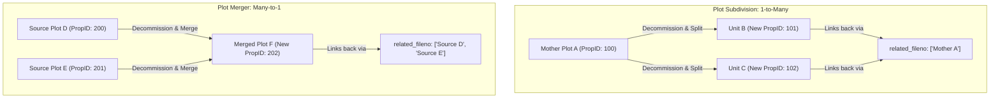
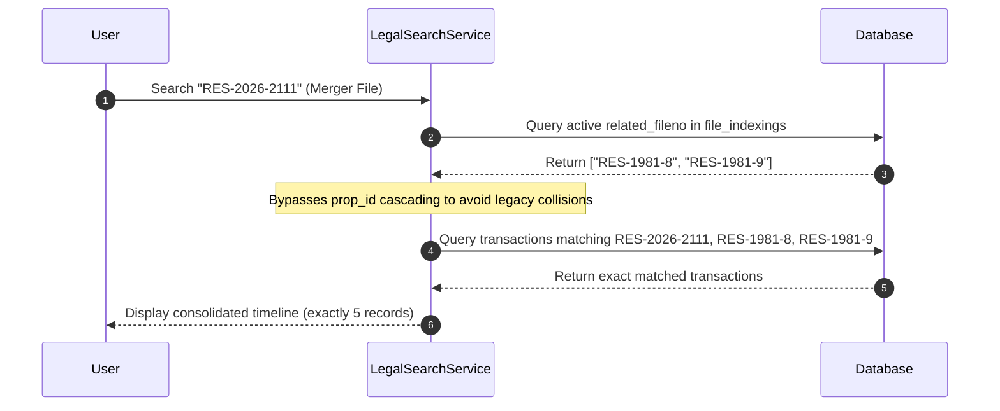

# Plot Management Technical Study: Subdivision, Merger, & Extension Workflows
**KLAES Land Administration & Registry System Monolith**

---

## 1. Executive Summary & Core Architectural Goals

The KLAES codebase integrates a strict boundary-adjustment system and clear data lifecycle processes to manage changes in physical land shapes. When land changes boundaries—whether divided, combined, or adjusted—the system must preserve historical data continuity while preventing data duplication.

This study details the business rules, database schema designs, operational workflows, and code logic governing **Plot Subdivision**, **Plot Merger**, and **Plot Extension/Exclusion** in the Laravel-based SQL Server monolith, along with our recent **Legal Search (LS)** precision integration.

### System Safeguards
1. **Zero Active Duplication**: Core active tables (`fileNumber`, `file_indexings`, `customers_staging`, `entities_staging`) must maintain exactly one record per active land parcel.
2. **Decommission-on-Replace**: Whenever a parcel is divided or merged, its active files are permanently removed from daily index tables and moved to the `decommissioned_files` archive.
3. **Historical Traceability**: Past transactions (CofO, Deeds, PRA, Valuation records) are never deleted. Instead, they are linked using explicitly defined file-number lineages so legal search results remain complete.
4. **Visual Differentiation**: Highlighting associated historical file numbers in red so users instantly identify past records distinct from the current active search item.
5. **No Sectional Titling (ST) Overlap**: Sectional Titling is an independent system; general plot boundary adjustments (Subdivisions, Mergers, and Extensions) do not include ST prefix matching.

---

## 2. Technical Taxonomy: The Three Workflows



### A. Plot Subdivision (1-to-Many)
* **Real-World Scenario**: An owner divides a large "Mother Plot" into separate commercial units or residential plots (e.g., standard residential subdivisions).
* **Lineage Principle**: The mother parcel's history belongs equally to all newly formed units. However, actions taken on a new unit (e.g., a mortgage taken on Unit B) must not appear on Unit C.
* **Legal Search Filtering Rules**:
  * If a search is conducted using a **unit file number** (e.g., `COM-2025-4-001`), only that specific unit's records and the mother file's records are displayed.
  * **All sibling units** (e.g., `COM-2025-4-002`) are strictly **excluded** from the timeline and transaction tables to keep the search clean and context-focused.
* **Database Execution**:
  1. **Decommission Summary**: The active Mother record is registered in the `decommissioned_files` table with the decommissioning reason `"Subdivision"`.
  2. **Detailed Registry Archiving**: The complete active `file_indexings` record, including all holders, plot size, lga, district, general registry, tracking_id, and metadata, is archived with full fidelity into the `deprecated_records` table.
  3. **Active Deletion**: Once safely archived, the Mother record is hard-deleted from active tables (`fileNumber`, `file_indexings`, `entities_staging`, and `customers_staging`).
  4. **New Entity Generation**: Standalone active records are created for each subdivided unit (e.g., `COM-2025-4-001`, `COM-2025-4-002`).
  5. **PropID Allocation**:
     - Each new unit is allocated a **brand-new, unique PropID** via the `PropertyIdAllocationService`.
     - The new active records save the Mother's file number in their `related_fileno` field.
  6. **History Search Resolution**: When a legal search is conducted on Unit B, the search engine queries transactions using the explicitly allowed file numbers derived from `related_fileno`.

---

### B. Plot Merger (Many-to-1)
* **Real-World Scenario**: An owner buys adjacent plots (e.g., Source Plots D and E) and combines them into one large industrial complex (Plot F).
* **Lineage Principle**: The new consolidated plot inherits the combined history of all source properties. The individual source plots cease to exist as separate legal entities.
* **Database Execution**:
  1. **Decommission Summary & Full Registry Archiving**: All source active files (D and E) are backed up both as summaries (in `decommissioned_files`) and as full-fidelity rich active records (in `deprecated_records`) under the `"Merger"` workflow type.
  2. **Active Deletion**: Once safely archived, the source records are hard-deleted from active index tables.
  3. **Consolidated Entry**: A single new active record is created for Plot F (e.g., `COM-2025-600`).
  3. **PropID Re-Allocation**:
     - A **new, unique PropID** is assigned to Plot F.
  4. **Lineage Mapping (History Transfer)**:
     - The consolidated new file contains the exact array of merged source file numbers in its `related_fileno` field.
     - When a legal search is performed on the new file (or any of the merged source files), the search engine retrieves the entire consolidated timeline by querying only the explicit set of file numbers in the merged record's `related_fileno`.
     - This guarantees complete and accurate timeline display without relying on collision-prone legacy PropIDs.

---

### C. Plot Extension & Exclusion (1-to-1 Adjustment)
* **Real-World Scenario**: Adjusting plot boundaries or extending a plot's layout by incorporating a small neighboring strip of land.
* **Lineage Principle**: Because this is a 1-to-1 replacement, it is treated as a specialized **Merger**. The original record is replaced entirely by the new extended layout.
* **Database Execution**:
  1. **Archiving**: The original active files are safely backed up as summaries (in `decommissioned_files`) and as complete indexing records (in `deprecated_records`) under the `"Extension"` workflow type.
  2. **Active Deletion**: The original record is deleted from active search indexes.
  3. **New Record Entry**: A new active record is created with the updated spatial boundaries and size.
  4. **PropID Allocation**: A new PropID is generated for the extended property.
  5. **Lineage Linkage**: The original file number is written to the new active file's `related_fileno` field to guarantee a continuous timeline.

---

## 3. Database Architecture & Schema Map

To support these workflows, the KLAES database structure relies on specific columns and tables:

### Core Tables Involved
* **`fileNumber` / `file_indexings`**: The primary tables for active registry searches.
* **`deprecated_records`**: The dedicated deep history archive table that holds complete, full-fidelity copies of all decommissioned file indexing records (under Merger, Subdivision, Plot Extension, CoP) before they are deleted.
* **`decommissioned_files`**: Holds metadata summaries for all retired properties.
* **`pra` / `deeds_registrations` / `c_of_o` / `file_history_staging`**: Historical transactions that maintain the legal chain of title.

### The Explicit Lineage Identifier
* **`related_fileno`**: A JSON array (e.g., `["RES-1981-8", "RES-1981-9"]`) stored in the active `file_indexings` table. It serves as the canonical identifier linking the new boundary-adjusted file back to its original source or mother files.

---

## 4. Legal Search (LS) Integration & Visual Rules

To provide a premium user experience and clear visual distinction, we implemented two major enhancements in the **Legal Search** module:

### I. Explicit Sibling Unit Exclusion & Safe SME Search
The backend filter in `LegalSearchService::search()` detects subdivided, merged, or extended file numbers and automatically applies strict filtering:
* Evaluates standard plot subdivisions (e.g. `COM-2025-4-001`) using `isSubdividedUnit()`, completely bypassing ST (Sectional Titling) prefix patterns.
* Resolves the explicitly allowed file numbers for the search using `getSmeAllowedFileNos()`. It queries `file_indexings` to decode `related_fileno` (for new merger/subdivision files) or reverse-resolves it (for decommissioned source files).
* Applies strict file-number filtering across all transaction tables, entirely bypassing broad `prop_id` expansions for SME searches. This completely eliminates SQL Server conversion overflows and legacy ID collisions.



### II. Visual Highlighting of Associated File Numbers
When legal searches retrieve histories containing multiple related files (due to mergers, extensions, or subdivisions), any file number that differs from the searched query is highlighted in a premium red badge:
* **Helper**: `renderFileNumberSpan()` in `resources/views/legal_search/js.blade.php`.
* **Styling**: `bg-red-50 text-red-600 border border-red-200 px-2 py-0.5 rounded text-xs font-semibold`
* **Coverage**: Applied to the main visual Timeline and all four category tables (Property Records, File History, Instrument Registration, and Certificates of Occupancy).
* **Hover Tooltip**: Displays a premium title tooltip: `"Associated Related File Number: [FileNo]"`.

---

## 5. Technical Implementation References

### Backend Logic (`app/Services/LegalSearchService.php`)
```php
/**
 * Retrieve explicitly related file numbers for Subdivision, Merger, and Extension (SME)
 * using the related_fileno identifier array from file_indexings.
 * Bypasses ST (Sectional Titling) files completely.
 */
public function getSmeAllowedFileNos(string $fileNo, $conn): array
{
    $fileNo = trim($fileNo);
    if ($fileNo === '') {
        return [];
    }

    // ST is a separate module; ignore ST prefix
    if (str_starts_with(strtoupper($fileNo), 'ST-')) {
        return [];
    }

    $allowed = [$fileNo];
    $isSme = false;

    // 1. Check active indexing
    $active = $conn->table('file_indexings')
        ->where('file_number', $fileNo)
        ->whereNull('deleted_at')
        ->first(['related_fileno']);

    if ($active && !empty($active->related_fileno)) {
        $decoded = json_decode($active->related_fileno, true);
        if (is_array($decoded) && !empty($decoded)) {
            $isSme = true;
            foreach ($decoded as $fn) {
                $allowed[] = trim($fn);
            }
        }
    } else {
        // 2. If decommissioned, find active record where this file is in its related_fileno
        $activeParent = $conn->table('file_indexings')
            ->whereNull('deleted_at')
            ->where('related_fileno', 'like', '%' . $fileNo . '%')
            ->first(['file_number', 'related_fileno']);
        
        if ($activeParent && !str_starts_with(strtoupper($activeParent->file_number), 'ST-')) {
            $decoded = json_decode($activeParent->related_fileno, true);
            if (is_array($decoded) && !empty($decoded)) {
                $isSme = true;
                $allowed[] = trim($activeParent->file_number);
                foreach ($decoded as $fn) {
                    $allowed[] = trim($fn);
                }
            }
        }
    }

    if ($isSme) {
        return array_values(array_unique($allowed));
    }

    return [];
}
```

### Frontend Badge Renderer (`resources/views/legal_search/js.blade.php`)
```javascript
// Helper: render file number as a red badge if it is different from the searched file number
const renderFileNumberSpan = (item, fieldType = 'fileNumber') => {
  const rawVal = getMappedValue(item, fieldType);
  const itemFileNo = String(rawVal || '').trim();
  const searchedFileNo = (window.__lsLastSearchedFileNumber || '').trim();
  
  const normalizeFN = (str) => {
    return str.toUpperCase().replace(/[\s\-_=\/]+/g, '');
  };
  
  if (searchedFileNo && itemFileNo && itemFileNo !== '-') {
    const normSearch = normalizeFN(searchedFileNo);
    const normItem = normalizeFN(itemFileNo);
    if (normSearch && normItem !== normSearch) {
      return `<span class="px-2 py-0.5 rounded text-xs font-semibold bg-red-50 text-red-600 border border-red-200" title="Associated Related File Number: ${itemFileNo}">${itemFileNo}</span>`;
    }
  }
  return itemFileNo;
};
```
