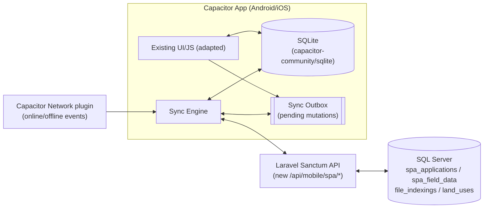

# SPAS Mobile — Offline-First (Capacitor + SQLite) Sync Plan

## 1. Goal

Turn the existing **SPAS Mobile · Special Assignment** web page into an installable app (Android first, iOS later) built with **Capacitor JS**, backed by a **local SQLite database**, so field surveyors can:

- Keep working (view records, add records, log field inspections, capture GPS/photos) **with zero network connection**.
- Automatically **sync to the live SQL Server DB** the moment the device regains network access — no manual export/import step.

This document is the implementation plan only — no code has been changed yet.

---

## 2. Current State (as it exists today)

### 2.1 What SPAS Mobile is right now
A single Blade view, **not a native/Capacitor app**:

- View: [resources/views/special_assignment/mobile.blade.php](../../resources/views/special_assignment/mobile.blade.php) — a self-contained "app-like" page (fixed topbar, bottom sheets, Leaflet map) served over the normal web stack (Blade + vanilla JS `fetch`, no framework, no bundler).
- Auth: **session-based** Laravel web auth (`auth()->attempt(...)` in `submitMobileLogin`), cookie/session — not token-based. Login/forgot/reset routes are public; everything else sits behind the standard `auth` middleware group.
- Data: 100% live-DB. Every list, lookup, and save is a `fetch()` call straight to `SpecialAssignmentController` endpoints on `sqlsrv` — nothing is cached or persisted client-side. No connectivity = the page is unusable.
- No Capacitor, no SQLite, no service worker, no offline handling exist anywhere in the repo today (verified — no `capacitor`/`sqlite` in `package.json`, no PWA manifest/service worker for this module).

### 2.2 Routes (`routes/apps2.php`)
```
# Public (guest) — login / password reset
special-assignment/mobile/login              GET/POST
special-assignment/mobile/forgot-password    GET/POST
special-assignment/mobile/reset-password/{t}  GET
special-assignment/mobile/reset-password      POST
special-assignment/mobile/logout              POST

# Authenticated (session) — inside routes/apps2.php `special-assignment.` group
GET  /special-assignment/mobile                     -> mobile()          (renders the app page)
GET  /special-assignment/check-file                 -> checkFileIndexed()
GET  /special-assignment/search-files               -> searchFileIndexings()
GET  /special-assignment/next-customary-fileno      -> nextCustomaryFileNumber()
GET  /special-assignment/land-records?ajax=1        -> landRecords()     (DataTables-style list)
GET  /special-assignment/field-data?ajax=1          -> fieldData()       (DataTables-style list)
POST /special-assignment/land-records/store         -> storeLandRecord()
POST /special-assignment/field-data/store           -> storeFieldData()
```

### 2.3 Controller: [SpecialAssignmentController.php](../../app/Http/Controllers/SpecialAssignmentController.php)
Relevant methods for the mobile app: `mobile()`, `checkFileIndexed()`, `searchFileIndexings()`, `nextCustomaryFileNumber()`, `landRecords()` (ajax branch), `fieldData()` (ajax branch), `storeLandRecord()`, `storeFieldData()`, plus `showMobileLogin/submitMobileLogin/mobileLogout/*ForgotPassword*/*ResetPassword*`.

### 2.4 Data model (SQL Server, `sqlsrv` connection)
- `spa_applications` — [SpaApplication](../../app/Models/SpaApplication.php) model. Anchor record per land case. Key columns: `file_number`, `tracking_id`, `file_indexing_id`, `is_indexed`, `land_title_type` (statutory|customary), `owner_name`, `phone`, `location/district/lga`, `land_use_type` (applied), `proposed_use` (approved), `existing_use` (prevailing on ground), `photos` (JSON array of storage paths), `status` (open→in_progress→approved→certificate_issued→closed), `created_by`.
- `spa_field_data` — [SpaFieldData](../../app/Models/SpaFieldData.php) model. One inspection per application (duplicate `file_number` rejected server-side). Columns: `spa_application_id`, `file_number`, `surveyor_id`, `inspection_date`, `coordinates` (JSON `{lat,lng}`), `parcel_geometry` (GeoJSON polygon), `findings`, `photos`, `status`.
- Reference/lookup data pulled live for the form: `file_indexings` + `fileNumber` (SQL Server) for file-number search/autofill, and `klas.dbo.land_uses` for the Approved/Prevailing land-use dropdowns.

### 2.5 Full "app form" walkthrough (what must be reproduced offline)

**Tab 1 — Records** (`page-records`): stat chips (Total/Open/In Progress), search box, card list of land records pulled from `landRecords()` (joins `file_indexings` ⋈ `fileNumber` ⋈ `spa_applications`). Each card can open the **Add Land Record** sheet pre-filled ("Not Added" cards) or trigger **Add Land Record** fresh via the floating action card.

**Sheet — Add Land Record** (`#sheet-add-record`, `POST land-records/store`):
- `land_title_type` toggle: **Statutory** (pick an existing indexed file via searchable dropdown → `search-files` + `check-file` autofills owner/location/land use/phone) vs **Customary** (no existing file; server generates a `SPAS-{YEAR}-{SEQ}` temp number via `next-customary-fileno`, owner typed manually).
- Fields: file number (auto), owner/file title (auto or manual), location badge (auto), applied land use (auto, read-only), **approved land use** (required select), **prevailing land use** (required select) → live **contravention badge** if approved ≠ prevailing, phone, property photos (multi-file, camera capture), plus an **inline optional field inspection** block (date, GPS/tap-map coordinates + polygon trace, findings) that fires a second `field-data/store` call right after the record save.

**Tab 2 — Field Records** (`page-verify`): search + list from `fieldData()` (application + its inspection, inspected/pending badge, contravention badge, applied vs prevailing land-use chips).

**Sheet — Log Field Inspection** (`#sheet-log-inspect`, `POST field-data/store`):
- Linked Application searchable combobox (excludes already-inspected apps), inspection date (required), coordinates (GPS button or tap-to-pin / polygon-trace on a Leaflet mini-map), findings (required), photos.
- Server rejects if a `spa_field_data` row already exists for that `file_number`, and auto-advances the parent application from `open` → `in_progress`.

**Tab 3 — Field Map** (`page-map`): Leaflet map (Esri World Imagery tiles — **requires network**) plotting every `spa_field_data` row with coordinates, colored by land use, filterable chips (ALL/RES/COM/AGR/IND), popup with photo/file no/owner/location/applied/approved/prevailing/contravention.

---

## 3. Target Architecture



Core idea: the UI **always reads/writes local SQLite first** (instant, offline-safe). A separate **sync engine** drains an outbox of pending mutations to the server whenever a connection is available, and periodically pulls fresh reference data + records back down.

---

## 4. Data model changes

### 4.1 Server-side (SQL Server) — additive, non-breaking
Add to `spa_applications` and `spa_field_data`:
- `client_uuid NVARCHAR(36) NULL` (unique index) — client-generated UUID so a record created offline can be pushed exactly once even if the app retries the request (idempotent create). Server already has autoincrement `id`; `client_uuid` is only used to detect/ignore duplicate pushes.
- No other schema changes required — all existing columns already match what the mobile form captures.

### 4.2 Local SQLite schema (on-device)
```
spa_applications        -- mirrors server columns + client_uuid (PK locally), sync_status, server_id (nullable until synced)
spa_field_data           -- same pattern, FK to spa_applications by client_uuid or server_id
file_index_cache         -- read-only cache: file_number, file_title, land_use_type, location, district, lga, tracking_id, file_indexing_id
land_use_cache           -- read-only cache: landuse
sync_outbox              -- id, entity_type, entity_client_uuid, operation(create/update), payload_json, photo_paths_json, attempts, last_error, created_at
sync_meta                -- key/value: last_pull_at per entity (records, field_data, file_index_cache, land_use_cache)
```
`sync_status` per row: `pending` | `synced` | `error`. UI shows a small badge (e.g. a cloud/clock icon) on cards that are still `pending`, matching the existing card style.

---

## 5. New API surface (Laravel)

Reuse the existing `SpecialAssignmentController` business logic — **extract the shared parts into a service class** (e.g. `App\Services\SpaMobileService`) so both the Blade AJAX endpoints (unchanged, for desktop/browser use) and the new JSON API call the same code, rather than duplicating validation/creation logic.

Add under `routes/api.php`, guarded by `auth:sanctum` (mirrors the existing [MobileAuthController](../../app/Http/Controllers/Api/Mobile/MobileAuthController.php) token pattern already used for the React Native app):

```
POST /api/spas/auth/login          -> issues Sanctum token (identifier + password + device_name)
POST /api/spas/auth/logout         -> revokes current token

GET  /api/spas/records?since=<ts>       -> delta pull: spa_applications updated after <ts>
GET  /api/spas/field-data?since=<ts>    -> delta pull: spa_field_data updated after <ts>
GET  /api/spas/lookup/file-index?since=<ts>&lga=   -> bounded file_indexings+fileNumber snapshot
GET  /api/spas/lookup/land-uses         -> land_uses table (small, full pull is fine)

POST /api/spas/records              -> create (accepts client_uuid; idempotent on retry)
POST /api/spas/field-data           -> create (accepts client_uuid; idempotent on retry)
POST /api/spas/photos               -> upload a photo for an already-synced record/field-data row
                                        (used when photos are captured offline and the record synced text-only first)
```

`since` is an ISO timestamp cursor stored in `sync_meta` on-device; the server filters by `updated_at > since` (`spa_applications`/`spa_field_data` already have Eloquent timestamps).

---

## 6. Sync engine design

### 6.1 Push (outbox → server)
1. Every local create in the UI writes to local SQLite immediately **and** appends a `sync_outbox` row.
2. When online (Capacitor `Network` plugin fires `networkStatusChange`, or app resumes, or user taps "Sync Now"), the sync engine processes the outbox **in order**, oldest first:
   - `spa_applications` creates before their related `spa_field_data` creates (dependency order), since field-data needs the server-assigned `spa_application_id` unless the API accepts `client_uuid` as the linkage key instead (**preferred** — lets both be pushed in either order / in the same batch).
   - Photos captured offline are stored via `@capacitor/filesystem` locally; on push, either (a) inline them as multipart with the create call if online at capture time, or (b) queue a separate `photos` upload keyed by `client_uuid` once the parent record has synced.
3. On success: mark outbox row `synced`, store the returned `server_id` on the local row, remove from outbox.
4. On failure: increment `attempts`, store `last_error`, retry with backoff; surface a "N records pending sync" indicator in the UI (already has a `toast()` helper to reuse) rather than failing silently.
5. Duplicate-file-number rule (already enforced server-side in `storeFieldData`) becomes a **sync conflict**, not a silent failure — surface it so the surveyor can resolve (e.g. delete the local duplicate or pick a different application).

### 6.2 Pull (server → local cache)
- On login and on each reconnect: pull `land_use_cache` (small, full refresh) and a **bounded** `file_index_cache` — do **not** attempt to mirror the entire `file_indexings`/`fileNumber` tables on-device. Recommended bounding, in order of preference:
  1. Only file numbers the surveyor has already looked up/opened (grows organically, works offline for repeat visits).
  2. Plus an optional server-side filter (e.g. by `lga`/`district` if SPAS surveyors are regionally assigned) to pre-seed a useful working set — **needs a product decision**, not assumed in this plan.
- Pull `spa_applications`/`spa_field_data` deltas via `since` cursor and upsert locally (server is authoritative for anything not in the local outbox as unsynced).

### 6.3 Conflict resolution rules
- Reference data (`land_uses`, `file_index_cache`): server always wins, simple overwrite.
- Records/field-data still `pending` locally: local wins until pushed (nobody else edits a record mid-flight in the current design — no multi-editor concurrency exists today).
- Records already `synced` and later changed on the server (e.g. an office user edits a synced SPAS record from the desktop `land_records` UI): pulled server version overwrites local, **unless** the local device also has a pending edit to the same row — flag as a manual conflict (rare edge case; log and show in a small "Conflicts" list rather than guessing).

---

## 7. Auth strategy

- Replace the mobile login flow's dependency on cookie/session auth with the existing **Sanctum token** pattern (already proven in `MobileAuthController` for the React Native app) so the app can authenticate API calls without a browser session.
- Store the token via `@capacitor/preferences` (or `capacitor-secure-storage-plugin` for stronger at-rest protection, since this handles land records with owner PII).
- Offline behavior: once logged in, the token and last-synced data remain usable **fully offline** (no forced re-auth check while offline) — the app only re-validates the token opportunistically when a network call succeeds/fails with 401, at which point it forces re-login without discarding unsynced local data.

---

## 8. Photos & file handling offline

- Capture via existing `<input type="file" capture="environment">` works inside a Capacitor WebView, but for reliable offline storage switch to `@capacitor/camera` + `@capacitor/filesystem`: write captured photos to app-private storage, keep local file URIs in SQLite (`photos_local` JSON), and only produce the final `storage/...` server paths after a successful multipart upload during sync.
- Compress/resize images client-side before upload (bandwidth — field connectivity in Kano is often 2G/3G).

---

## 9. Map & GPS offline considerations

- `@capacitor/geolocation` replaces `navigator.geolocation` for more reliable native GPS (works fully offline).
- Leaflet + Esri World Imagery tiles **require network** — out of scope to fully solve in this plan. Two pragmatic options to pick from later (not decided here):
  1. Ship the "Field Map" tab as **online-only** (grey out / show "connect to view map" when offline) while pin-drop/polygon-trace capture in the Add/Log sheets still works fully offline (they only need Leaflet's *drawing* canvas, not necessarily satellite tiles — can fall back to a blank/grid background offline).
  2. Pre-cache a limited set of tiles for known operating areas (adds real complexity/storage cost) — flag as a stretch goal only if surveyors repeatedly work the same zones.

---

## 10. Phased implementation plan

| Phase | Scope | Key deliverables |
|---|---|---|
| 0 | **API foundation** | Extract shared logic into `SpaMobileService`; add `routes/api.php` `/api/spas/*` endpoints (auth, delta pull, create, photo upload); add `client_uuid` columns + migration |
| 1 | **Capacitor shell** | `npm init @capacitor/app`; wrap current mobile UI as the Capacitor `www/` build; install `@capacitor/geolocation`, `@capacitor/filesystem`, `@capacitor/preferences`, `@capacitor/network`, `@capacitor-community/sqlite`; get an installable Android debug build running against the existing live-DB endpoints (no offline yet) |
| 2 | **Local schema & data layer** | Create local SQLite schema (§4.2); build a small `db.js` data-access module; seed `land_use_cache`/`file_index_cache` on login |
| 3 | **Offline-first CRUD** | Rewire `mobile.blade.php`'s fetch calls to read/write SQLite first and enqueue `sync_outbox` entries; add pending/synced badges to record & inspection cards |
| 4 | **Sync engine** | Implement push/pull per §6, wired to `Network` plugin events + manual "Sync Now" + app-resume trigger |
| 5 | **Auth & security** | Sanctum token login/logout, secure token storage, offline-session behavior per §7 |
| 6 | **QA & rollout** | Airplane-mode round-trip test script (create record offline → reconnect → verify row + photos land in SQL Server), pilot with a handful of surveyor devices, monitor `sync_outbox` failure rate before wider rollout |

---

## 11. Open questions (need a product decision before Phase 2)

1. Should `file_index_cache` be scoped by LGA/district per surveyor, or organically grown from lookups only? (affects payload size and Phase 2 pull design)
2. Is per-surveyor **record ownership/assignment** needed (today all SPAS mobile users see the same full list — confirm this stays true offline too)?
3. Target platforms: Android only for v1, or Android + iOS from the start? (affects Capacitor plugin choices/signing setup)
4. Acceptable staleness window for the Field Map tab when offline — hide it entirely, or show last-cached pins without tiles?

---

## 12. Files referenced in this plan

- [resources/views/special_assignment/mobile.blade.php](../../resources/views/special_assignment/mobile.blade.php)
- [app/Http/Controllers/SpecialAssignmentController.php](../../app/Http/Controllers/SpecialAssignmentController.php)
- [app/Models/SpaApplication.php](../../app/Models/SpaApplication.php)
- [app/Models/SpaFieldData.php](../../app/Models/SpaFieldData.php)
- [app/Http/Controllers/Api/Mobile/MobileAuthController.php](../../app/Http/Controllers/Api/Mobile/MobileAuthController.php) (token-auth pattern to mirror)
- [routes/apps2.php](../../routes/apps2.php)
- [docs/templates/spas_create_tables.sql](../templates/spas_create_tables.sql)
- [docs/templates/spas_mobile_splashscreen.html](../templates/spas_mobile_splashscreen.html)
