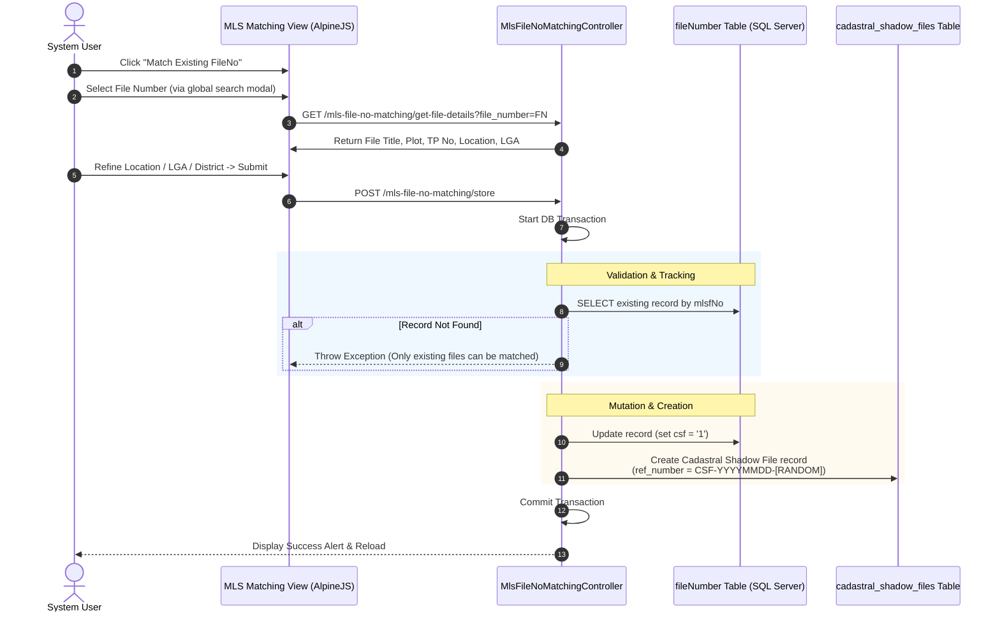

# Match Existing FileNo (MLSFileNo) & Cadastral Shadow Files (CSF) Study Report

This study report provides an in-depth explanation of the **Match Existing FileNo (MLSFileNo)** workflow and the management of **Cadastral Shadow Files (CSF)** within the KLAES system.

---

## 🧭 Architectural Context & Purpose

The **Match Existing FileNo (MLSFileNo)** module acts as a bridge between legacy files recorded in the system (stored in the central `fileNumber` table) and active Cadastral indexing. 

When legacy file numbers require cadastral verification or mapping, staff use this module to **match** the file numbers to their physical/geospatial locations, generating a **Cadastral Shadow File (CSF)**. This ensures that:
- Central property records can be located and matched to physical land boundaries.
- Active cadastral searches and title transactions link correctly to old file histories.
- The system maintains strict audit trails regarding which user matched which file and when.

---

## 📐 Data Flow & Store Pipeline

The diagram below represents the exact workflow executed when matching an existing MLS file number:



---

## 💾 Database Schemas

### 1. The `cadastral_shadow_files` Table
This table stores the metadata specifically captured during the matching process.

| Column | Type | Nullable | Description / Logic |
| :--- | :--- | :--- | :--- |
| **`id`** | `bigint` (PK) | No | Auto-incrementing identifier. |
| **`ref_number`** | `string` | Yes | Unique CSF reference: `"CSF-YYYYMMDD-[4-digit-rand]"`. |
| **`full_number`** | `string` | Yes | The matched file number (e.g., `mlsfNo` format). |
| **`file_name`** | `string(500)` | Yes | The title or owner of the file. |
| **`plot_no`** | `string` | Yes | Physical plot identifier. |
| **`location`** | `string` | Yes | Programmatically formatted location string. |
| **`lga`** | `string` | Yes | Local Government Area name. |
| **`tracking_id`** | `string` | Yes | 12-digit cross-table allocation/tracking identifier. |
| **`created_by`** | `integer` | Yes | User ID of the operator who matched the file. |
| **`date_matched`** | `date` | Yes | Date the match occurred (`YYYY-MM-DD`). |
| **`time_matched`** | `time` | Yes | Time the match occurred (`HH:MM:SS`). |
| **`is_deleted`** | `boolean` | No | Soft deletion status (defaults to `0`). |

### 2. The `fileNumber` Table Integration
The central `fileNumber` table contains a column **`csf`**. 
- During matching, `csf` is updated to `'1'`, marking the file as an active **Cadastral Shadow File**.
- On record updates (name, plot number, location changes), the controller updates both the `cadastral_shadow_files` record and the `fileNumber` record concurrently inside a transaction to prevent data divergence.

---

## 🛠️ Key Controller Workflows (`MlsFileNoMatchingController`)

### 1. The Match Store Endpoint (`store`)
- **Validation**: Enforces `full_file_number`, `file_title`, `lga_id`, and `location`.
- **Integrity Checks**:
  ```php
  $existingFile = FileNumber::where('mlsfNo', $fullFileNumber)->first();
  if (!$existingFile) {
       throw new \Exception("Record not found in system. Only existing file numbers can be matched.");
  }
  ```
- **CSF Flagging**:
  ```php
  FileNumber::where('mlsfNo', $fullFileNumber)->update(['csf' => '1']);
  ```
- **Unique CSF Number Generation**:
  ```php
  'ref_number' => 'CSF-' . date('Ymd') . '-' . rand(1000, 9999)
  ```

### 2. The Edit & Update Pipeline (`edit` & `update`)
- **Adaptation**: Fetches the shadow record using `CadastralShadowFile::findOrFail($id)` and maps fields (such as `full_number` -> `full_file_number`) to comply with the frontend requirements.
- **Divergence Syncing**: When updating, the controller synchronizes changes to both tables:
  ```php
  $record->update([
      'file_name' => $validated['file_name'],
      'plot_no' => $validated['plot_no'],
      'location' => $validated['location'],
      'lga' => $lga->name ?? $record->lga,
  ]);

  FileNumber::where('mlsfNo', $record->full_number)->update([
      'FileName' => $validated['file_name'],
      'plot_no' => $validated['plot_no'],
      'location' => $validated['location'],
      'lga' => $lga->name ?? null,
  ]);
  ```

### 3. Smart Details Lookup (`getFileDetails`)
When a file number is selected, the system tries to pull metadata from three tables sequentially to pre-fill the match form:
1. **`fileNumber` (Legacy Table)**: Extracts `FileName`, `plot_no`, `location`, `lga`, `type`, and `tracking_id`.
2. **`file_indexings` (Dedicated Indexing Table)**: Merges/overrides fields, adding `tp_no`, `district_name`, `lga_name`, and `customer_type`.
3. **`file_indexing_links` (Link Table)**: Pulls details if matched as a child or subdivision.

---

## ⚡ Lands Registry vs. MLS Registry Architectural Differences

A key architectural distinction exists between the **Lands** registry and the **MLS** registry matching protocols:

| Feature | Match MLS (Cadastral Shadow Files) | Match Lands (Lands Shadow Files) |
| :--- | :--- | :--- |
| **Primary Flags** | Sets `csf = '1'` in `fileNumber`. | Sets `pp_lands_matching = 1`, `pp_lands_date_matched`, `pp_lands_time_matched`. |
| **Model Creation** | **Yes**. Generates a separate `CadastralShadowFile` record. | **No**. Transitions to a "matching-only" system where LandsShadowFile records are no longer created. |
| **History Table** | Records stored in `cadastral_shadow_files`. | Uses `fileNumber` match columns directly for reporting/statistics. |

---

## 📊 Dashboard Statistics Integration

The indices on `CadastralShadowFile` allow real-time reporting of matching actions:
- **Daily matches**: `CadastralShadowFile::where('is_deleted', 0)->whereDate('date_matched', date('Y-m-d'))->count()`
- **Monthly stats**: 
  ```php
  CadastralShadowFile::where('is_deleted', 0)
      ->whereMonth('date_matched', date('m'))
      ->whereRaw('YEAR(date_matched) = ?', [date('Y')])
      ->count()
  ```
- **Total indexed**: Displays a summary using `FileIndexing::where('is_corresponding_file', 1)->count()`.

---

> [!NOTE]
> All actions inside the Match Existing FileNo module are wrapped in database transactions (`DB::connection('sqlsrv')->beginTransaction()`) to ensure absolute atomic execution across `fileNumber` and `cadastral_shadow_files`.
